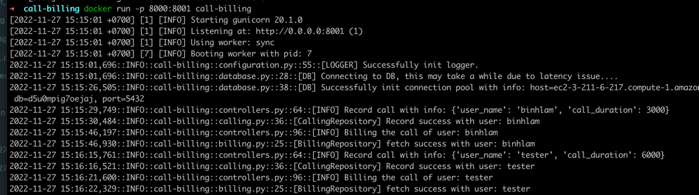
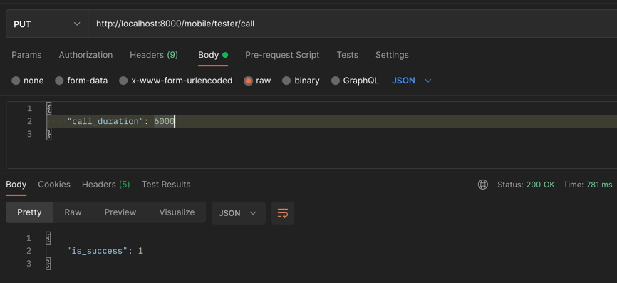
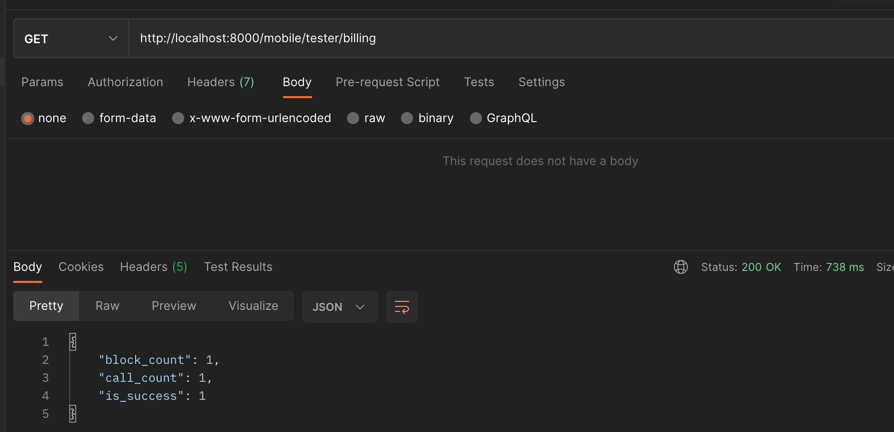

## Developing a server side call-billing application with Flask
### Created date: 2022-11-26
### Author: *Binh Lam*

# Notes
- Due to unclear statement about having to manage user data, I assume that we already have user model and its related module management such as: 
  - user accounts (including create/update user info)
  - authorization (including manage user token for login and permission on apis)
- Postgres database is already setup in a free trial instance of heroku, thus it may end ups a bit slow on init connection (at most 30s).
- Thus, on this assessment, I only focus on the two apis mentioned in the test. If you would like me to work more on the above issues, please inform me.

Test one new mac 2

# Environment Setup
1. Run the server-side with Virtualenv:

    ```sh
    cd call-billing
    python3 -m venv callbillingenv
    source callbillingenv/bin/activate
    pip install -r requirements.txt
    ```
    * API RUN:
    ```sh
        cd ~/virtualenvs/callbillingenv/bin
        gunicorn --timeout 3000 --bind 127.0.0.1:8000 main:run()
    ```

2. Run the server-side with Docker:
   ```sh
    cd call-billing
    docker build . --no-cache -t call-billing:latest
    ```
    * API RUN:
    ```
        docker run -p 8000:8001 call-billing
    ```
      

3. Run unittest (local) - after starting app:
   ```sh
      python3 test/call_billing.py
   ```
   

4. Sample curl:
   ```sh
   curl --location --request PUT 'http://localhost:8000/mobile/tester/call' \
        --header 'Content-Type: application/json' \
        --data-raw '{
          "call_duration": 6000
        }'
   ```
   

   ```sh
   curl --location --request GET 'http://localhost:8000/mobile/tester/billing'
   ```
   

   